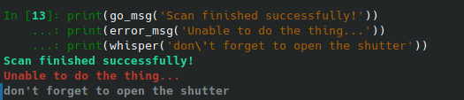
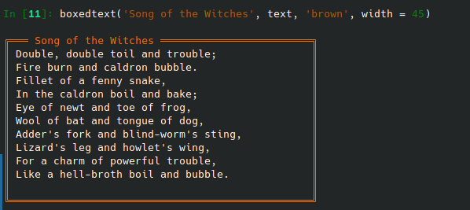

.. _colored_text:

Colored text in bsui
====================

.. admonition:: Section Topic

   Many of the example code blocks in the sections showing code
   developed at BMM show functions and tools used at BMM which are not
   standard parts of IPython or Bluesky.  This section shows code
   listings for those things.

   :Lesson: Develop convenient tools for applying color and style to
	    text written to the bsui terminal.

   :Beamline: `BMM <https://wiki-nsls2.bnl.gov/beamline6BM/index.php?Main_Page>`__

   :Link to source code: `functions.py <https://github.com/NSLS-II-BMM/profile_collection/blob/master/startup/BMM/functions.py#L34>`__

   :Section author: Bruce Ravel (bravel@bnl.gov)

Colorful terminal text
----------------------

BMM users do a lot at the command line.  It is helpful to have tools
for emphasizing text printed to the screen in various ways.  Happily,
IPython provides good tools for applying ASCII colors and accents to
terminal text.  The following is some syntactic sugar making those
tools easier to use.

There are several examples of the colored text shortcuts in
:ref:`the status method shown in the Linkam code listing <linkam_codelisting>`.

.. code-block:: python
   :linenos:

    from IPython.utils.coloransi import TermColors as color

    def colored(text, tint='white', attrs=[]):
        '''
        A simple wrapper around IPython's interface to TermColors
        '''
        tint = tint.lower()
        if 'dark' in tint:
            tint = 'Dark' + tint[4:].capitalize()
        elif 'light' in tint:
            tint = 'Light' + tint[5:].capitalize()
        elif 'blink' in tint:
            tint = 'Blink' + tint[5:].capitalize()
        elif 'no' in tint:
            tint = 'Normal'
        else:
            tint = tint.capitalize()
        return '{0}{1}{2}'.format(getattr(color, tint), text, color.Normal)

    def error_msg(text):
        '''Red text'''
        return colored(text, 'lightred')
    def warning_msg(text):
        '''Yellow text'''
        return colored(text, 'yellow')
    def go_msg(text):
        '''Green text'''
        return colored(text, 'lightgreen')
    def url_msg(text):
        '''Text without decoration, reserved for URL decoration...'''
        return colored(text, 'normal')
    def bold_msg(text):
        '''Bright white text'''
        return colored(text, 'white')
    def verbosebold_msg(text):
        '''Bright cyan text'''
        return colored(text, 'lightcyan')
    def list_msg(text):
        '''Cyan text'''
        return colored(text, 'cyan')
    def disconnected_msg(text):
        '''Purple text'''
        return colored(text, 'purple')
    def info_msg(text):
        '''Brown text'''
        return colored(text, 'brown')
    def whisper(text):
        '''Light gray text'''
        return colored(text, 'darkgray')

This, then, associates different colors and accents on the text to
meaningful words.  "Error" means bright red text.  "Go" means bright,
green text, and so on.

Examples:

.. code-block:: python

   print(go_msg('Scan finished successfully!'))

   print(error_msg('Unable to do the thing...'))

   print(whisper('don\'t forget to open the shutter'))

.. _fig-colored-text-example:

   Examples of colored text

Boxed blocks of text
--------------------

Additional emphasis can be placed on a block of text by putting it in
a box with a title line at the top.  This uses the ``colored()``
function shown above to color the characters making up the walls of
the box.

The :ref:`Linkam status display <fig-linkam-statusbox>` is an example of this
in use, with some of the interior text being displayed using the
``colored()`` function described above.

.. code-block:: python
   :linenos:

   import ansiwrap

   def boxedtext(title, text, tint, width=75):
      '''
      Put text in a lovely unicode block element box.  The top
      of the box will contain a title.  The box elements will
      be colored.
      '''
      remainder = width - 2 - len(title)
      ul        = u'\u2554' # u'\u250C'
      ur        = u'\u2557' # u'\u2510'
      ll        = u'\u255A' # u'\u2514'
      lr        = u'\u255D' # u'\u2518'
      bar       = u'\u2550' # u'\u2500'
      strut     = u'\u2551' # u'\u2502'
      template  = '%-' + str(width) + 's'

      print('')
      print(colored(''.join([ul, bar*3, ' ', title, ' ', bar*remainder, ur]), tint))
      for line in text.split('\n'):
          lne = line.rstrip()
          add = ' '*(width-ansiwrap.ansilen(lne))
          print(' '.join([colored(strut, tint), lne, add, colored(strut, tint)]))
      print(colored(''.join([ll, bar*(width+3), lr]), tint))

Example:

.. code-block:: python

   text = '''Double, double toil and trouble;
   Fire burn and caldron bubble.
   Fillet of a fenny snake,
   In the caldron boil and bake;
   Eye of newt and toe of frog,
   Wool of bat and tongue of dog,
   Adder's fork and blind-worm's sting,
   Lizard's leg and howlet's wing,
   For a charm of powerful trouble,
   Like a hell-broth boil and bubble.
   '''
   boxedtext('Song of the Witches', text, 'brown', width=45)

.. _fig-colored-text-boxedtext:

   Example of boxed text with a brown border
