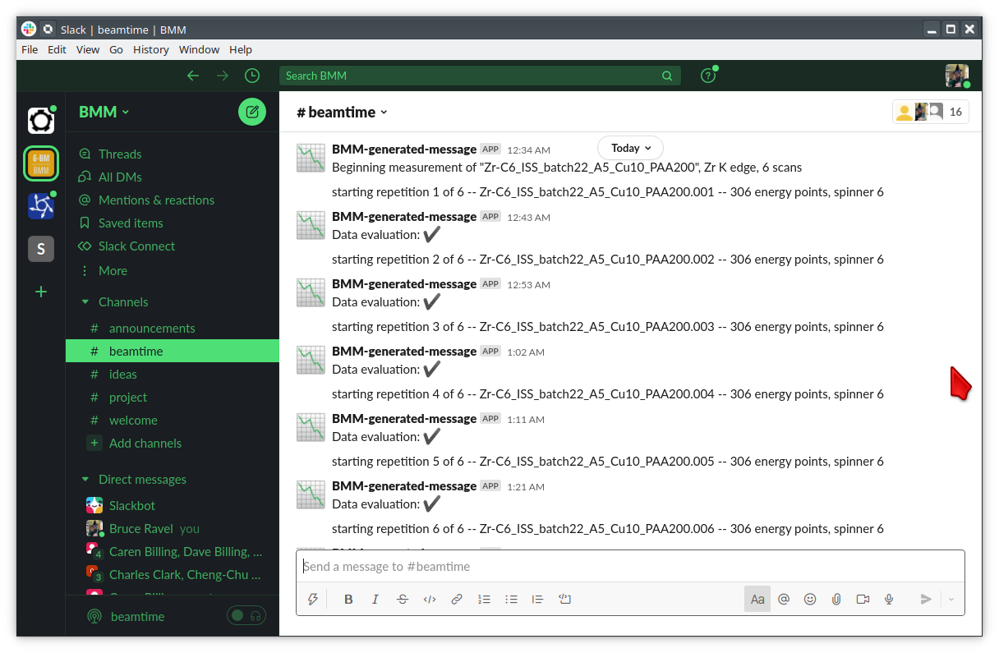

Posting a text message to Slack
===============================

Create a Webhook
----------------

To get started on using Slack at the beamline (or, really, anywhere),
you need to create what Slack calls a "webhook".  This is a sort of
key for negotiating communications between your Bluesky plans and a
specific channel in a specific workspace.  Here are detailed
instructions from Slack for creating your very own webhook:
https://api.slack.com/messaging/webhooks#create_a_webhook

For example, at BMM, we have a workspace called :guilabel:`BMM` with a
channel called :guilabel:`beamtime`.  I followed Slack's instructions
to create a webhook, which resulted in a long, weird URL.  This URL is
your secret bit of information which is used to negotiate the
communication. 

This secret URL must be guarded at some level.  You **should not**
copy the URL into a file which gets committed to your beamline Github
account.  Slack is amazingly good at noticing if you do that.  The
first time I tried this, I put the URL in a text file and checked that
text file into Github.  20 minutes later, I got an email from Slack
saying that they had disabled that webhook.  Big Brother is watching!

Once I made a new webhoook, I copied the URL into a text file, then
stored that text file on the NAS storage that we have at the
beamline.  That is sufficiently out of view of Big Brother's watchful
eye.

At line 7 to 12 in the code list that follows, I read the secret URL
from the NAS and store it in a variable (``default_slack_channel``)
which is in the scope of the file defining the communication with
Slack.  That should be sufficiently secure. (It's not really all that
secure, but it seems to be enough for my use at the beamline.)

Note that it should be OK to put the secret file on a Lustre drive.
That should be sufficiently out of view of Slack secret-sniffing
robots. 

Code for posting text
---------------------

Here is the code for posting a bit of text to a Slack channel.

.. code-block:: python
   :linenos:

      from slack_sdk import WebClient
      from slack_sdk.errors import SlackApiError

      ## small effort to obfuscate the web hook URL, which is secret-ish.  See:
      ##   https://api.slack.com/messaging/webhooks#create_a_webhook
      ## in the future, this could be an ini with per-user channel URLs...
      slack_secret = os.path.join(startup_dir, 'BMM', 'slack_secret')
      try:
          with open(slack_secret, "r") as f:
              default_slack_channel = f.read().replace('\n','')
      except:
          print(error_msg('\t\t\tslack_secret file not found!'))

      def post_to_slack(text):
          channel = default_slack_channel
          post = {"text": "{0}".format(text)}
          try:
              json_data = json.dumps(post)
              req = request.Request(channel,
                                    data=json_data.encode('ascii'),
                                    headers={'Content-Type': 'application/json'} ) 
              resp = request.urlopen(req)
          except Exception as em:
              print("EXCEPTION: " + str(em))
              print(f'slack_secret = {slack_secret}')

This can be used at the ``bsui`` command line or in a Bluesky plan
like so:

.. code-block:: python

   from beamline_slack import post_to_slack
   post_to_slack('This is my message.')

Here is what it looks like for BMM.  As you can see, a message is
posted as each individual XAS scan is started and finished.

.. _fig-slack-text:

   Posting text messages to Slack.

The content of the text message can be anything and of any length.  As
you can see from the example in the figure, the messages are
constructed from text relevant to the measurement being made.  The
messages can even include emoji.  For example, you see the
``:heavy_check_mark:`` emoji, which is used to communicate the result
of the test run by BMM's machine learning data evaluation tool.

