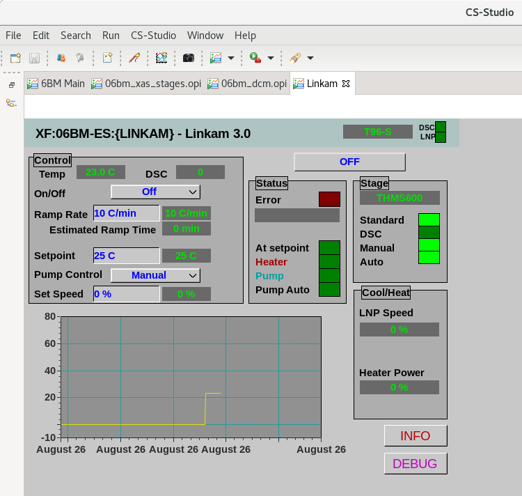

Linkam Stage
============

At BMM, we have a Linkam heating stage, `Model THMS600
<https://www.linkam.co.uk/thms600>`__.  This is the device with a
heater that goes up to 500C plus a liquid nitrogen cooling circuit to
cool samples down to nearly 77K.  This model comes with the T96
controller for which Jakub Wlodek recently wrote an IOC.

Our controller box has an RS-232 card in one of the back slots.  We
communicate to this via a Moxa terminal server with the IOC running on
one of the beamline's IOC servers..

Jakub also provided us with a CSS screen as an interface to the
Linkam.  Here's what that looks like.

.. _fig-css:

   The CSS screen for the Linkam T96.

The plan at BMM is to incorporate this stage into our system for
beamline automation.  In short, the user will fill out a spreadsheet
describing the sequence of the experiment.  At a sequence of
temperatures:

#. Move the stage to the indicated temperature
#. Measure XAFS at that temperature
#. Optionally change edge one or more times and measure XAFS at each
   edge and at the current temperature.

To make this happen, we need an Ophyd object.

Jakub has a handy tool that generates a bare-bones list of Ophyd
object components from the PVs served by an IOC.  Here's what he
provided:

.. code-block:: python
   :linenos:

     init = Cpt(EpicsSignal, 'INIT')                  
     model = Cpt(EpicsSignal, 'MODEL')                
     serial = Cpt(EpicsSignal, 'SERIAL')              
     stage_model = Cpt(EpicsSignal, 'STAGE:MODEL')    
     stage_serial = Cpt(EpicsSignal, 'STAGE:SERIAL')  
     firm_ver = Cpt(EpicsSignal, 'FIRM:VER')          
     hard_ver = Cpt(EpicsSignal, 'HARD:VER')          
     ctrllr_err = Cpt(EpicsSignal, 'CTRLLR:ERR')      
     config = Cpt(EpicsSignal, 'CONFIG')              
     status = Cpt(EpicsSignal, 'STATUS')              
     stage_config = Cpt(EpicsSignal, 'STAGE:CONFIG')  
     temp = Cpt(EpicsSignal, 'TEMP')                  
     disable = Cpt(EpicsSignal, 'DISABLE')            
     dsc = Cpt(EpicsSignal, 'DSC')                    
     startheat = Cpt(EpicsSignal, 'STARTHEAT')        
     ramprate_set = Cpt(EpicsSignal, 'RAMPRATE:SET')  
     ramprate = Cpt(EpicsSignal, 'RAMPRATE')          
     ramptime = Cpt(EpicsSignal, 'RAMPTIME')          
     holdtime_set = Cpt(EpicsSignal, 'HOLDTIME:SET')  
     holdtime = Cpt(EpicsSignal, 'HOLDTIME')          
     setpoint_set = Cpt(EpicsSignal, 'SETPOINT:SET')  
     setpoint = Cpt(EpicsSignal, 'SETPOINT')          
     power = Cpt(EpicsSignal, 'POWER')                
     lnp_speed = Cpt(EpicsSignal, 'LNP_SPEED')        
     lnp_mode_set = Cpt(EpicsSignal, 'LNP_MODE:SET')  
     lnp_speed_set = Cpt(EpicsSignal, 'LNP_SPEED:SET')

That's obviously a good start.  You see PVs for things like
temperature readback at line 12, set point at lines 21 and 22, power
output at line 23 ... useful stuff.

Making a bare bones Ophyd object is dead simple.  This functions and
involves little more that wrapping the component list in a bit of
boilerplate.

.. code-block:: python
   :linenos:

     from ophyd import Device, Component as Cpt, EpicsSignal

     class Linkam(PVPositioner):
         '''A very simple ophyd wrapper around the Linkam T96 controller
	 '''
 
	 init = Cpt(EpicsSignal, 'INIT')                  
	 model = Cpt(EpicsSignal, 'MODEL')                
	 serial = Cpt(EpicsSignal, 'SERIAL')              
	 stage_model = Cpt(EpicsSignal, 'STAGE:MODEL')    
	 stage_serial = Cpt(EpicsSignal, 'STAGE:SERIAL')  
	 firm_ver = Cpt(EpicsSignal, 'FIRM:VER')          
	 hard_ver = Cpt(EpicsSignal, 'HARD:VER')          
	 ctrllr_err = Cpt(EpicsSignal, 'CTRLLR:ERR')      
	 config = Cpt(EpicsSignal, 'CONFIG')              
	 status = Cpt(EpicsSignal, 'STATUS')              
	 stage_config = Cpt(EpicsSignal, 'STAGE:CONFIG')  
	 temp = Cpt(EpicsSignal, 'TEMP')                  
	 disable = Cpt(EpicsSignal, 'DISABLE')            
	 dsc = Cpt(EpicsSignal, 'DSC')                    
	 startheat = Cpt(EpicsSignal, 'STARTHEAT')        
	 ramprate_set = Cpt(EpicsSignal, 'RAMPRATE:SET')  
	 ramprate = Cpt(EpicsSignal, 'RAMPRATE')          
	 ramptime = Cpt(EpicsSignal, 'RAMPTIME')          
	 holdtime_set = Cpt(EpicsSignal, 'HOLDTIME:SET')  
	 holdtime = Cpt(EpicsSignal, 'HOLDTIME')          
	 setpoint_set = Cpt(EpicsSignal, 'SETPOINT:SET')  
	 setpoint = Cpt(EpicsSignal, 'SETPOINT')          
	 power = Cpt(EpicsSignal, 'POWER')                
	 lnp_speed = Cpt(EpicsSignal, 'LNP_SPEED')        
	 lnp_mode_set = Cpt(EpicsSignal, 'LNP_MODE:SET')  
	 lnp_speed_set = Cpt(EpicsSignal, 'LNP_SPEED:SET')

     linkam = Linkam('XF:06BM-ES:{LINKAM}:', name='linkam')

This works. You can set a set point with

.. code-block:: python

   linkam.setpoint_set.put(100)

and read the temperature with

.. code-block:: python

   linkam.temp.get()

There are, however, a number of shortcomings with this overly simple
approach.

#. The signal that the stage has *reached* its temperature setpoint is
   buried in the bit sequence reported by the ``status`` attribute.
#. Putting a temperature change in a bluesky plan is difficult with
   this object because it does not provide a way to block plan
   execution until the temperature is at the set point.
#. In this form, you cannot use the bluesky stub plan ``mv()`` because
   there is no way to signal that the temperature change is done.
#. The attributes ``model``, ``serial``, and so on report information
   about the specific versions and serial numbers of the stage and
   controller.  However, these PVs return lists of integers rather
   than human-readable strings.

All of these problems are solvable, but require a deeper dive into
Ophyd.  We will take that deeper dive in the next section.

